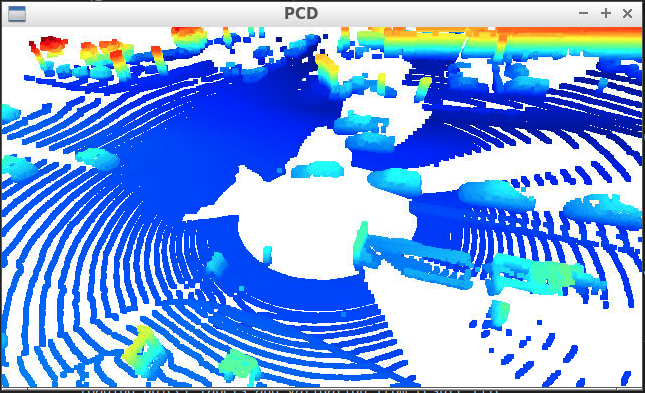
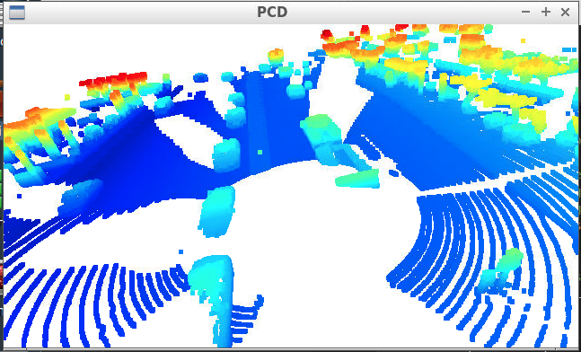
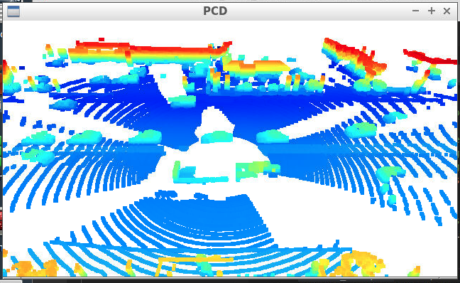
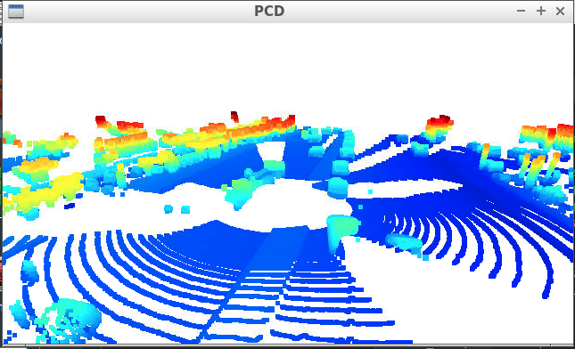
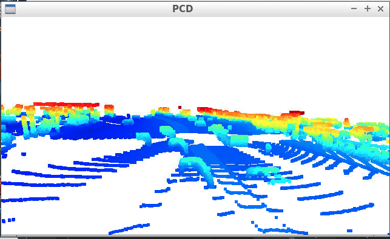
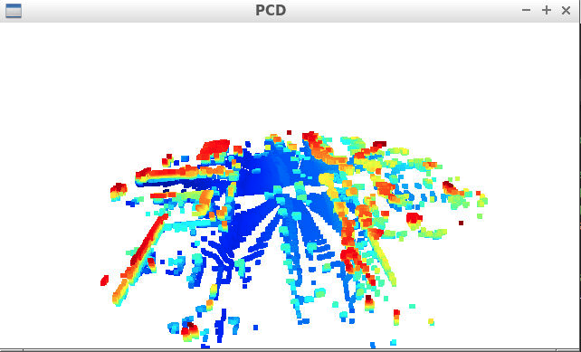
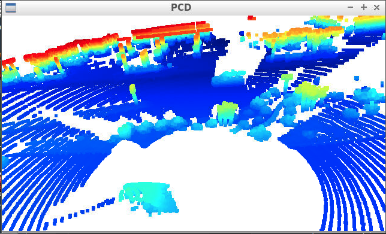
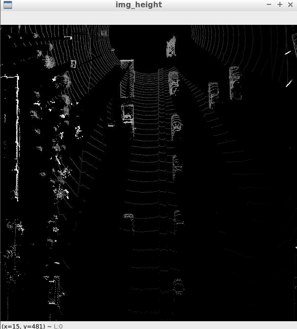
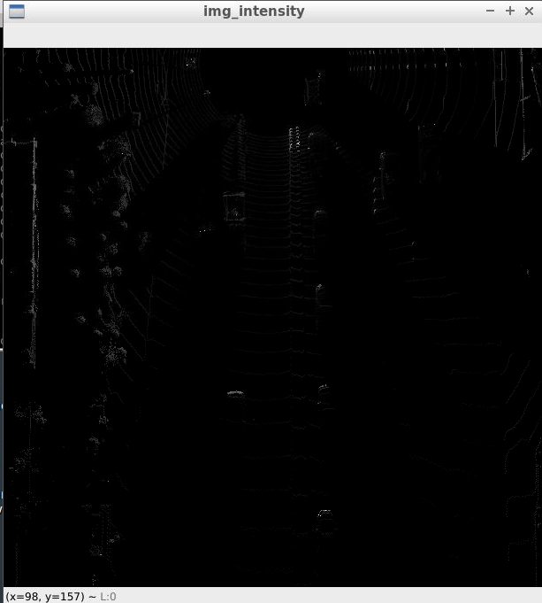

# Writeup: Track 3D-Objects Over Time

## 1. Write a short recap of the four tracking steps and what you implemented there (filter, track management, association, camera fusion). Which results did you achieve? Which part of the project was most difficult for you to complete, and why?

1. Create range image and intensity image.

I extracted features in LIDAR pointcloud. First feature is range feature in top of the image. Another feature is intensity image in bottom of the image.

2. Create plot of pointcloud

I checked features of vehicle shape using pointcloud data. Almost all Shape of vehicles looks like box.

Height of vehicles are lower than trees, and we can use this feature to extract vehicles from pointcloud.

In the center of figure, there is a truck. The shape of the truck is complicated and LIDAR pointcloud cannot be returned from the truck, but it somehow looks L-shape.

We cannot obtain pointcloud of vehicles which are occluded by other vehicle.

LIDAR can detect roof top of vehicles.

Vehicles drive on flat road. We can use this context to detect vehicles.

Shapes of vegetation does not look box or L-shape.

3. Extract features

I extracted height features from pointclouda and map onto BEV.

I also extracted intensity features from pointcloud and map onto BEV.

4. ML

## 2. Do you see any benefits in camera-lidar fusion compared to lidar-only tracking (in theory and in your concrete results)? 
hoge.

## 3. Which challenges will a sensor fusion system face in real-life scenarios? Did you see any of these challenges in the project?
hoge.

## 4. Can you think of ways to improve your tracking results in the future?
hoge.
